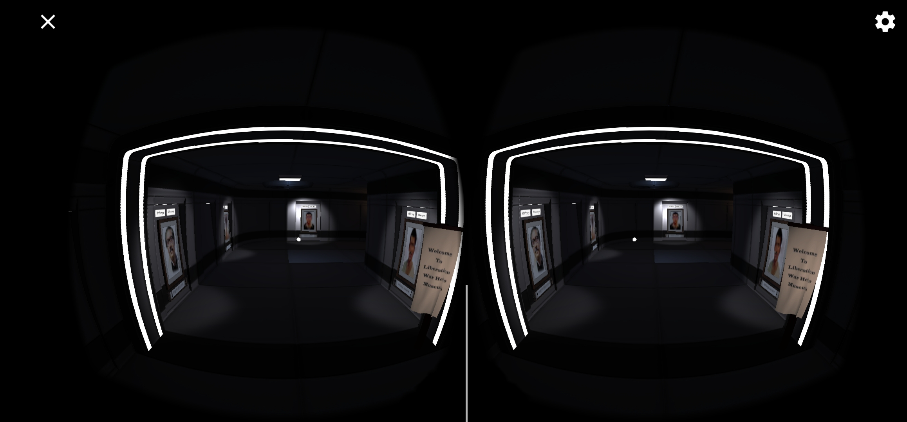
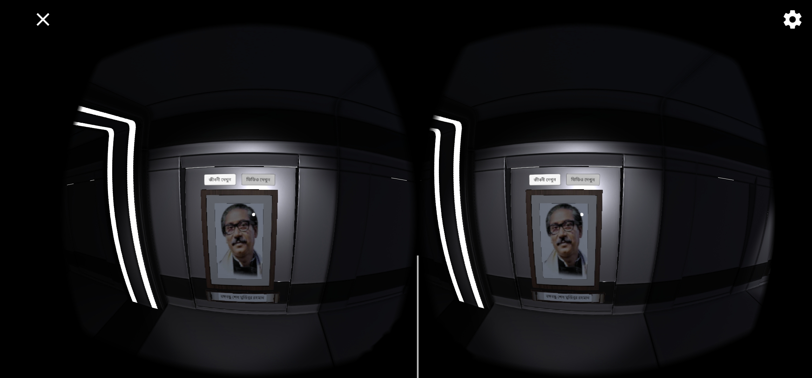
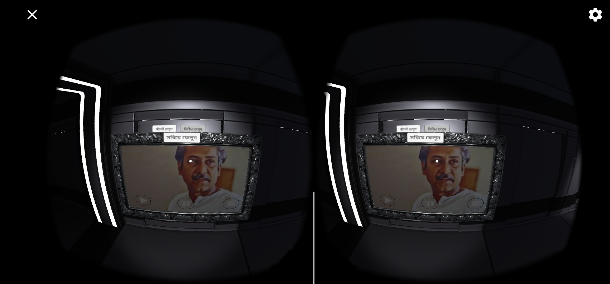
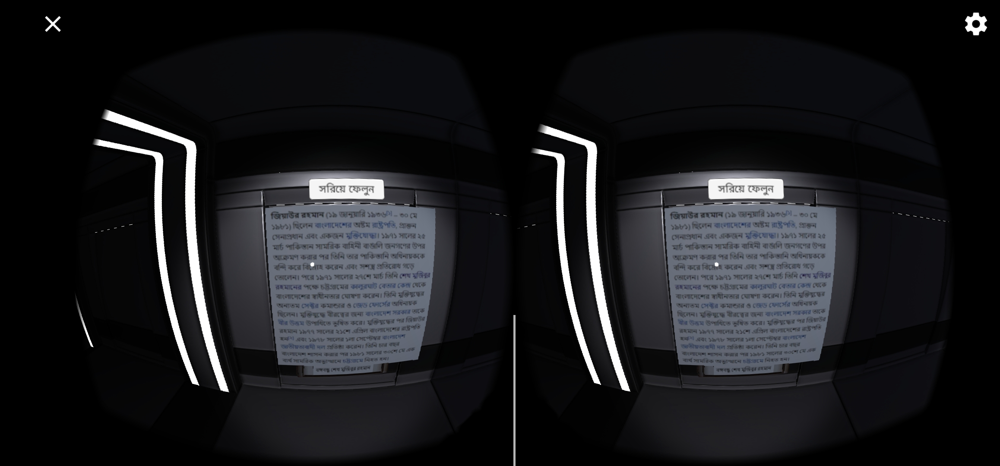
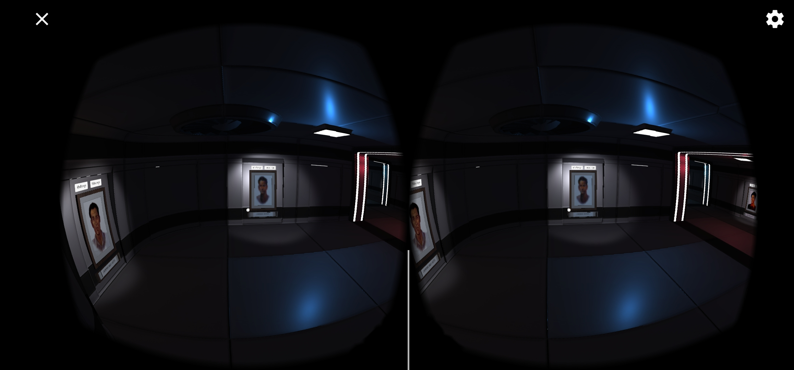
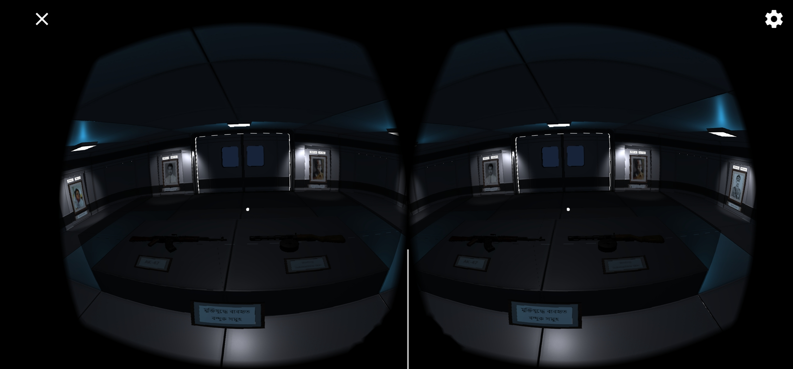
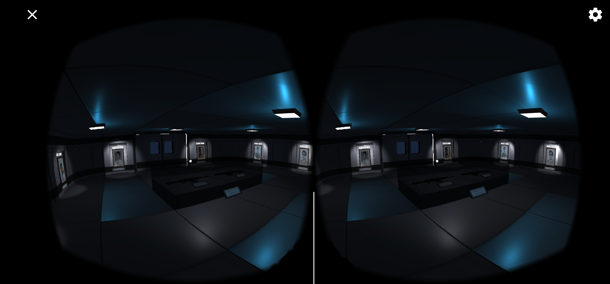

<h1 align="center">
   
  Liberation War Hero Museum
   
</h1>

<h4 align="center">Liberation War Hero Museum is a VR android app/game built on top of <a href="https://unity.com/" target="_blank" style="color:##0276E8;">Unity
Game engine </a>.</h4>

## Table of Contents
* [Video](#video)
* [Screenshots](#screenshots)
* [About the Project](#about-the-project)
* [Key Features](#key-features)
* [Built With](#built-with)
* [License](#license)
* [Contact](#contact)

## Video

https://github.com/AnikKazi-dev/Liberation_War_Hero_Museum-Unity/assets/36131816/0e9ecabf-8281-4e53-a701-f27ef2a8cb36

## Screenshots 

  
  
  
  
  
  
  

## About the project

* Android VR game/app
* Developed with Unity Engine and Google VR SDK

## Key Features

* Allows users to explore a museum of 1971 Bangladesh Liberation War heroes
* Features photo exhibitions of war soldiers
* Provides written biographies
* Includes video formats for biographies

## Built With

This software uses the following packages:

- [Unity Engine](https://unity.com/)
- [C#](https://unity.com/how-to/learning-c-sharp-unity-beginners)
- [Visual Studio Code](https://code.visualstudio.com/)

## Contact

>  - [GitHub](https://github.com/AnikKazi-dev) 
>  - [LinkedIn](https://www.linkedin.com/in/kazi-anik-7a2978172/)
